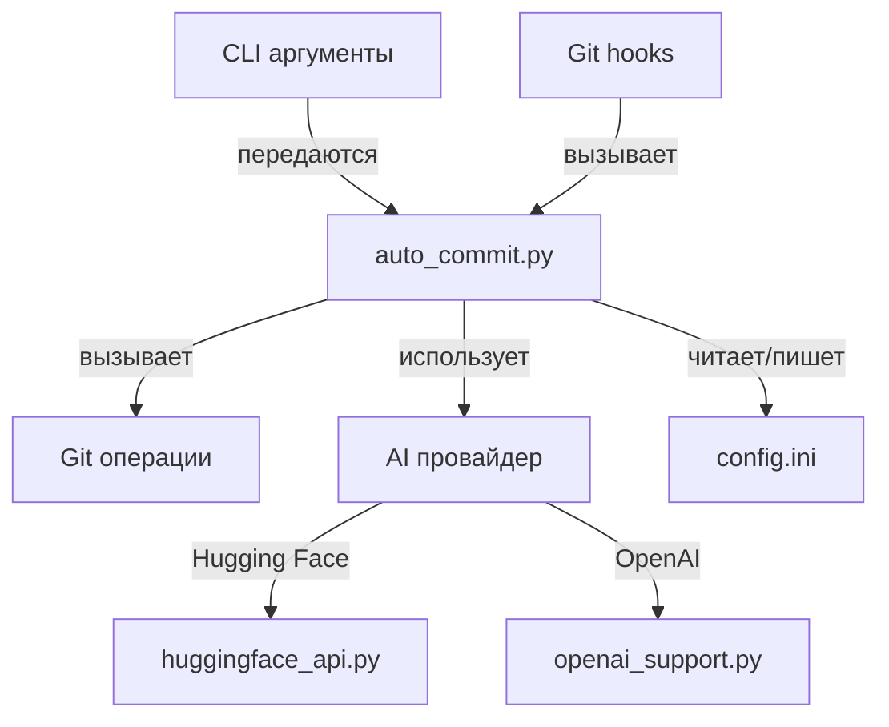

# Описание проекта CommitPilot

## Обзор

CommitPilot - это инструмент для автоматизации создания осмысленных git-коммитов с использованием искусственного интеллекта. Он анализирует изменения в коде и генерирует подходящее сообщение для коммита в формате [Conventional Commits](https://www.conventionalcommits.org/).

## Цели проекта

1. Сократить время, затрачиваемое разработчиками на написание сообщений коммитов
2. Повысить качество и информативность сообщений в репозитории
3. Обеспечить соблюдение единого формата коммитов в команде
4. Предоставить удобный инструмент, который легко интегрируется в существующий процесс разработки

## Архитектура



### Компоненты

1. **Core Module (auto_commit.py)**

    - Центральный компонент, управляющий всеми операциями
    - Обрабатывает аргументы командной строки
    - Координирует работу с Git и AI провайдерами

2. **AI Provider Modules**

    - Модули для взаимодействия с различными AI API
    - Преобразуют git diff в запросы к API
    - Обрабатывают ответы и извлекают сообщения для коммитов

3. **Installation & Integration**
    - Установочный скрипт (install.sh)
    - Git hooks для автоматической интеграции
    - Алиасы для удобного использования

## Технический стек

-   **Язык программирования**: Python 3.6+
-   **Зависимости**:
    -   requests - для HTTP запросов к API
    -   configparser - для работы с конфигурационным файлом
-   **Внешние API**:
    -   Hugging Face Inference API
    -   OpenAI API (опционально)
-   **Интеграции**:
    -   Git hooks

## Процесс работы

1. Пользователь вносит изменения в код
2. Запускает команду `acommit` (или использует обычный git commit с настроенными hooks)
3. Скрипт получает git diff и status изменений
4. Отправляет данные в выбранный AI API
5. Получает сгенерированное сообщение
6. Создает коммит с этим сообщением
7. При необходимости отправляет изменения в удаленный репозиторий

## Формат сообщений

CommitPilot генерирует сообщения в формате Conventional Commits:

```
тип(область): описание

[опциональное тело]

[опциональный footer]
```

где:

-   **тип** - категория изменений (feat, fix, docs, style, refactor, test, chore)
-   **область** - часть кодовой базы, которая изменяется (опционально)
-   **описание** - краткое объяснение изменений

## Дорожная карта

### Краткосрочные планы

-   Интеграция с дополнительными AI провайдерами
-   Улучшение точности определения типа коммита
-   Оптимизация производительности для больших репозиториев

### Долгосрочные планы

-   Создание плагинов для популярных IDE
-   Поддержка локальных AI моделей
-   Многоязычная поддержка для сообщений коммитов
-   Интеграция с системами CI/CD

## Заключение

CommitPilot предоставляет современное решение для улучшения процесса управления версиями, сочетая мощь искусственного интеллекта с простотой использования. Инструмент позволяет команде поддерживать высокое качество истории коммитов при минимальных усилиях.
